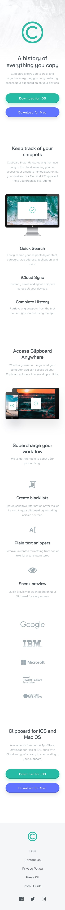

# Frontend Mentor - Clipboard landing page

## Table of contents

- [Overview](#overview)
  - [The challenge](#the-challenge)
  - [Screenshot](#screenshot)
  - [Links](#links)
- [My process](#my-process)
  - [Built with](#built-with)

## Overview

## The challenge

Your challenge is to build out this landing page and get it looking as close to the design as possible.

You can use any tools you like to help you complete the challenge. So if you've got something you'd like to practice, feel free to give it a go.

Your users should be able to: 

- View the optimal layout for the site depending on their device's screen size
- See hover states for all interactive elements on the page

### Screenshot

Mobile design

Desktop design

### Links

- Solution URL: [Clipboard landing page](https://www.frontendmentor.io/solutions/clipboard-landing-page-y3FGnmREfK)
- Live Site URL: [Add live site URL here](https://jpbyte.github.io/clipboard-landing-page/)

## My process

### Built with

- Semantic HTML5 markup
- CSS
- SASS/SCSS
